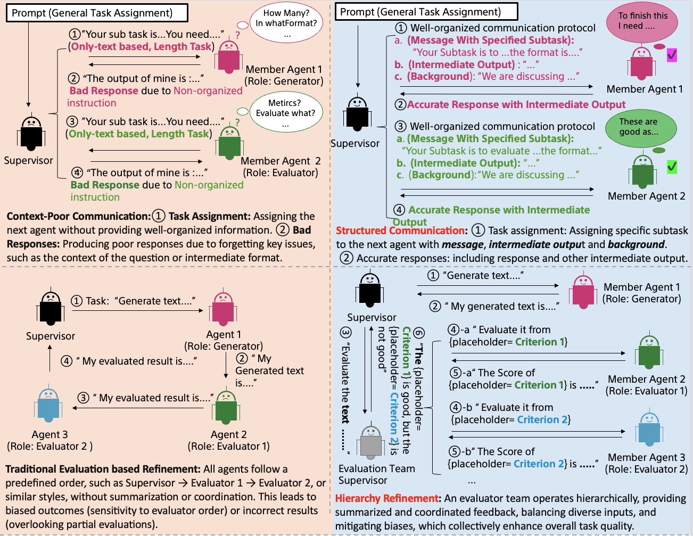

# Talk Structurally, Act Hierarchically: A Collaborative Framework for LLM Multi-Agent Systems

## Overview
This repository contains the official implementation of the multi-agent LLM system described in the paper **“Talk Structurally, Act Hierarchically: A Collaborative Framework for LLM Multi-Agent Systems”** by Zhao Wang, Moriyama Sota, Wei-Yao Wang, and Briti Gangopadhyay. For simplicity, we refer to our model as ***TalkHier***. ***TalkHier*** models hierarchical agent communication to efficiently solve complex tasks by leveraging structured conversations. It introduces a novel framework that establishes a structured communication protocol for context-rich exchanges and a hierarchical refinement system to address issues such as incorrect outputs, falsehoods, and biases.

## Architecture



***TalkHier*** consists of two types of agents:
- **Supervisor Agents**: Responsible for selecting which member agent should communicate next.
- **Member Agents**: Execute tasks and report back to the supervisor.

Each task defines its own **graph-based structure**, ensuring that communication pathways are dynamically determined based on the input problem.


## Installation

### Manual Installation
To set up the environment manually, follow these steps:
```sh
# 1. Unzip the zip file

# 2. Enter the folder
cd TalkHier

# 3. Create a virtual environment
python -m venv env
source env/bin/activate  # On Windows use `env\\Scripts\\activate`

# 4. Install dependencies
pip install -r requirements.txt
```

### Docker Compose Installation
To set up the system using Docker Compose:
```sh
# 1. Unzip the zip file

# 2. Enter the folder
cd TalkHier/docker

# Build and start the container
docker-compose up --build
```
This will use the `Dockerfile` to build the necessary environment and start the system.

## Usage
To run the system, execute the following command:
```sh
python experiments.py --mode [Problem]
```

### Configuration
Modify `config/config_llm.ini` and add the keys.

```sh
[KEYS]

SERPAPI_API_KEY = *************************************

OPENAI_API_KEY = *************************************

OPENAI_ENDPOINT = *************************************
```

**Need to replace your own key**

```sh
[LLM]

deployment_name=*******

openai_api_version=**********
```
**Need to set up Open AI API version**


## Examples
To test the system with a predefined task:
```sh
python experiments.py --mode moral_scenario
```
